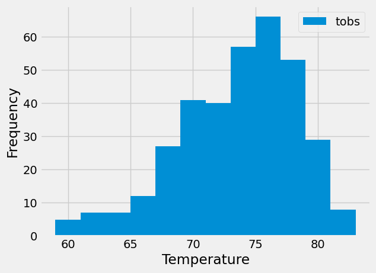

# Sqlalchemy Challenge - SurfsUp

## Analyze and Explore the Climate Data

Using Python and SQLAlchemy a basic climate analysis and data exploration of the climate database is done. 
Specifically, SQLAlchemy ORM queries, Pandas, and Matplotlib were used to explore the data.

### Precipitation Analysis
For the most recent date in the dataset, get the previous 12 months of precipitation data by querying the previous 12 months of data.
Create a bar chart to plot the precipitation data.

### Station Analysis
Calculate the lowest, highest, and average temperatures that filters on the most-active station id.

Get the previous 12 months of temperature observation (TOBS) data for the most active station and plot it in a histogram.

## Climate App

Climate app provides an API that returns valuable insights of the climate data. The queries developed in the previous sections are used here. 

Following routes are provided by the API
  * /api/v1.0/precipitation - returns Precipitation data
  * /api/v1.0/stations - returns a list of Stations 
  * /api/v1.0/tobs - returns a list of temperature observations for the previous year
  * /api/v1.0/<start> - returns a list of the minimum temperature, the average temperature, and the maximum
    temperature for a specified start date
  * /api/v1.0/<start>/<end> - - returns a list of the minimum temperature, the average temperature, and the maximum
            temperature for a specified start and end date (inclusive)
## Files

* Dataset - /SurfsUp/Resources/hawaii.sqlite
* Jupyter Notbook - /SurfsUp/climate_starter.ipynb
* Python APp - /SurfsUp/app.py

## Run Instructions

* Launch Jupyter Notebook jupyter notebook
* Jupyter Notebook is opened in a browser
* Open "SurfsUp/climate_starter.ipynb" file using Jupyter Notebook
* Click on 'Cell > Run All' to run

* To run Climate App API: 
* From a termial, change directory to SurfsUp
* python app.py
* Test the API routes using browser or Postman

# References
Menne, M.J., I. Durre, R.S. Vose, B.E. Gleason, and T.G. Houston, 2012: An overview of the Global Historical Climatology Network-Daily Database. Journal of Atmospheric and Oceanic Technology, 29, 897-910, [https://journals.ametsoc.org/view/journals/atot/29/7/jtech-d-11-00103_1.xml].

# Disclaimer
This repo was published for educational purpose only. Copyright 2023-2024 edX Boot Camps LLC. All rights reserved.
